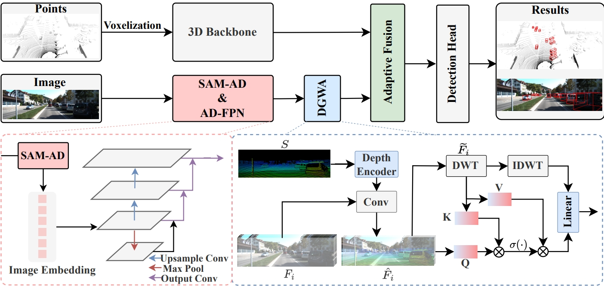

<div align="center">   

# RoboFusion: Towards Robust Multi-Modal 3D Object Detection via SAM
</div>

<div align="justify">  

This is the official repository of [**RoboFusion**](https://arxiv.org/abs/2401.03907). 

:fire: Our work has been accepted by IJCAI 2024!

</div>

------

<div align="justify">  

:fire: Contributions:
* We utilize features extracted from SAM rather than inference segmentation results.
* We propose **SAM-AD**, which is a pre-trained SAM for AD scenarios.
* We introduce a novel **AD-FPN** to address the issue of feature upsampling for aligning VFMs with multi-modal 3D object detector.
* To further reduce noise interference and retain essential signal features, we design a **Depth-Guided Wavelet Attention (DGWA)** module that effectively attenuates both high-frequency and low-frequency noises.
* After fusing point cloud features and image features, we propose {\bf Adaptive Fusion} to further enhance feature robustness and noise resistance through self-attention to re-weight the fused features adaptively. 

</div>

# Abstract

<div align="justify"> 

Multi-modal 3D object detectors are dedicated to exploring secure and reliable perception systems for autonomous driving (AD). However, while achieving state-of-the-art (SOTA) performance on clean benchmark datasets, they tend to overlook the complexity and harsh conditions of real-world environments. Meanwhile, with the emergence of visual foundation models (VFMs), opportunities and challenges are presented for improving the robustness and generalization of multi-modal 3D object detection in autonomous driving. Therefore, we propose **RoboFusion**, a robust framework that leverages VFMs like SAM to tackle out-of-distribution (OOD) noise scenarios. We first adapt the original SAM for autonomous driving scenarios named **SAM-AD**. To align SAM or **SAM-AD** with multi-modal methods, we then introduce **AD-FPN** for upsampling the image features extracted by SAM. We employ wavelet decomposition to denoise the depth-guided images for further noise reduction and weather interference. Lastly, we employ self-attention mechanisms to adaptively reweight the fused features, enhancing informative features while suppressing excess noise. In summary, our RoboFusion gradually reduces noise by leveraging the generalization and robustness of VFMs, thereby enhancing the resilience of multi-modal 3D object detection. Consequently, our RoboFusion achieves state-of-the-art performance in noisy scenarios, as demonstrated by the KITTI-C and nuScenes-C benchmarks.

</div>

# Method

<div align="center">
  
</div>

<div align="justify">

Our RoboFusion framework. The LiDAR branch almost follows the baselines (FocalConv,TransFusion) to generate LiDAR features. In the camera branch, first, we extract robust image features using a highly optimized SAM-AD and acquire multi-scale features using AD-FPN. Secondly, the sparse depth map $S$ is generated by the raw points and fed into depth encoder to obtain depth features and fused with multi-scale image features $F_i$ to obtain depth-guided image features $\hat{F}_i$. Then wave attention is used to remove the mutation noise. Finally, adaptive Fusion integrates point cloud features with robust image features with depth information via self-attention mechanism.

</div>

<div align="center">
  
</div>

<div align="justify">

Illustration of the pre-training framework. We corrupt the clean image $x$ by $\eta$ which contains multiple weather noises and then randomly masking several patches on a noisy image $x + \eta$ to obtain a masked noisy image $Mask(x+\eta)$. The SAM-AD and DMAE decoder are trained to reconstruct the clean image $\hat{x}$ from $Mask(x+\eta)$.

</div>

> ---------------------------------------------------------

# Dataset Preparation

## KITTI and nuScenes (clean dataset)

Please refer to clean dataset: [OpenPCDet](https://github.com/open-mmlab/OpenPCDet/blob/master/docs/GETTING_STARTED.md) and MMdetection3D([KITTI](https://github.com/open-mmlab/mmdetection3d/blob/main/docs/zh_cn/advanced_guides/datasets/kitti.md) and [nuScenes](https://github.com/open-mmlab/mmdetection3d/blob/main/docs/zh_cn/advanced_guides/datasets/nuscenes.md)).

## KITTI-C and nuScenes-C (noisy dataset)

Please refer to [noise dataset](https://github.com/thu-ml/3D_Corruptions_AD).

# Getting Start

## Pre-train SAM

Please refer to [DMAE](https://github.com/quanlin-wu/dmae) for how to pre-train orginal SAM.

## TransFusion + SAM

Please refer to [TransFusion+SAM.md](https://github.com/modaxiansheng/RoboFusion/blob/main/doc/Transfusion%2BSAM.md) for how to add SAM to TransFusion.

## FocalsConv + SAM

Please refer to [FocalsConv+SAM.md](https://github.com/modaxiansheng/RoboFusion/blob/main/doc/FocalsConv%2BSAM.md) for how to add SAM to FocalsConv.

# Acknowledgement

Many thanks to these excellent open source projects:

- [MMDetection3D](https://github.com/open-mmlab/mmdetection3d)
- [OpenPCDet](https://github.com/open-mmlab/OpenPCDet)
- [TransFusion](https://github.com/XuyangBai/TransFusion/)
- [FocalsConv](https://github.com/dvlab-research/FocalsConv)
- [3D_Corruptions_AD](https://github.com/thu-ml/3D_Corruptions_AD)
- [SAM](https://github.com/facebookresearch/segment-anything)
- [DMAE](https://github.com/quanlin-wu/dmae)
# Cite

Please cite our work by this:

```
@article{song2024robofusion,
  title={Robofusion: Towards robust multi-modal 3d obiect detection via sam},
  author={Song, Ziying and Zhang, Guoxing and Liu, Lin and Yang, Lei and Xu, Shaoqing and Jia, Caiyan and Jia, Feiyang and Wang, Li},
  journal={arXiv preprint arXiv:2401.03907},
  year={2024}
}
```
